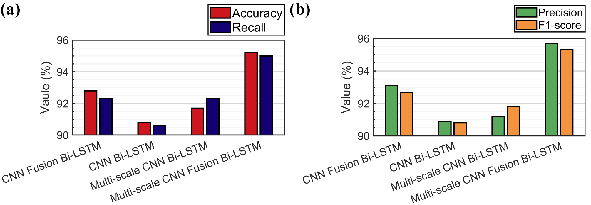

# Portable ECG and PCG wireless acquisition system and multiscale CNN feature fusion Bi-LSTM network for coronary artery disease diagnosis

This repository contains the implementation of multiscale CNN feature fusion Bi-LSTM network. Also contains the implementation of baseline CNN_Bi-LSTM, Multi-Scale_CNN_Bi-LSTM, CNN_Fusion_Bi-LSTM for comparison.

All these methods were programmed according the literature information.

## Files description

Each file's functionality is self-explanatory by its name.

## Results

The following illustration present the comparable results.

## License

The MIT License (MIT)

Copyright (c) 2018 Francisco Perdigon Romero

Permission is hereby granted, free of charge, to any person obtaining a copy of this software and associated documentation files (the "Software"), to deal in the Software without restriction, including without limitation the rights to use, copy, modify, merge, publish, distribute, sublicense, and/or sell copies of the Software, and to permit persons to whom the Software is furnished to do so, subject to the following conditions:

The above copyright notice and this permission notice shall be included in all copies or substantial portions of the Software.

THE SOFTWARE IS PROVIDED "AS IS", WITHOUT WARRANTY OF ANY KIND, EXPRESS OR IMPLIED, INCLUDING BUT NOT LIMITED TO THE WARRANTIES OF MERCHANTABILITY, FITNESS FOR A PARTICULAR PURPOSE AND NONINFRINGEMENT. IN NO EVENT SHALL THE AUTHORS OR COPYRIGHT HOLDERS BE LIABLE FOR ANY CLAIM, DAMAGES OR OTHER LIABILITY, WHETHER IN AN ACTION OF CONTRACT, TORT OR OTHERWISE, ARISING FROM, OUT OF OR IN CONNECTION WITH THE SOFTWARE OR THE USE OR OTHER DEALINGS IN THE SOFTWARE.